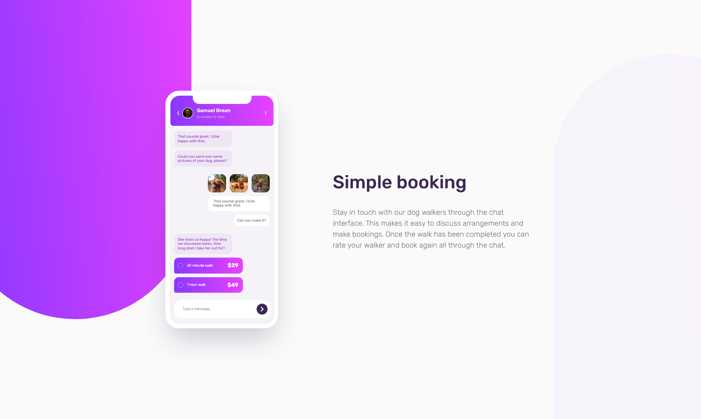

# Frontend Mentor - Chat app CSS illustration

This is a solution to the [Chat app CSS illustration challenge on Frontend Mentor](https://www.frontendmentor.io/challenges/chat-app-css-illustration-O5auMkFqY). Frontend Mentor challenges help you improve your coding skills by building realistic projects.

## The challenge

Your challenge is to build out this feature illustration using HTML & CSS and get it looking as close to the design as possible.

The only assets we provide in this challenge are the image of the person in the app UI and the 3 images of the dog. You need to create everything else using HTML & CSS!

Your users should be able to:

- View the optimal layout for the component depending on their device's screen size
- **Bonus**: See the chat interface animate on the initial load

### Screenshot

### Links

- Solution URL: [Github](https://github.com/MAOButNotTheDong/frontend-mentor-challenges/tree/main/chat-app-css-illustration)
- Live Site URL: [netlify](https://gilded-pasca-638d61.netlify.app/)

## Author

- Frontend Mentor - [@MAOButNotTheDong](https://www.frontendmentor.io/profile/MAOButNotTheDong)
